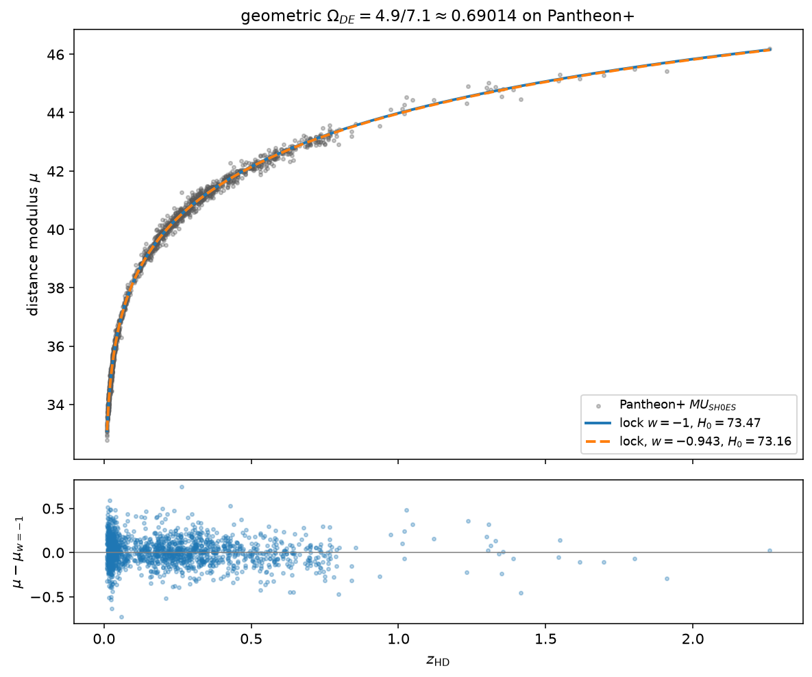
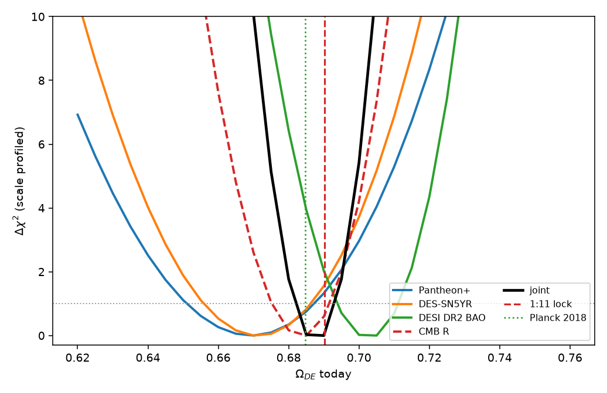

# Hierarchical dark energy

An alternative, testable framework for the present-day dark-energy density.
The axioms are **assumed for the experiment**. Under those axioms the
density is locked, not fitted:

\[
\Omega_{DE} = \frac{4.9}{7.1} = \frac{49}{71} \approx 0.69014
\]

Combined supernova, BAO, and CMB-distance data sit on that number
(\(\Delta\chi^2 = 0.05\)). This is not a claim to have derived dark energy
from first principles, and it does not resolve the Hubble tension.



## Construction

- The physical octave is the frequency ratio \(2:1\). The smallest equal
  division that still approximates the low-integer ratios is a **12-fold
  period**.
- **Assumption:** that period is scale-invariant, including in the vacuum /
  dark-energy sector.
- Planar square coordinations: \(q=4\) (Euclidean) and \(q=5\) (first
  hyperbolic).
- Unique **minimal mixed** fill of one 12-period: 1 seed of \(q=4\) + 11
  steps of \(q=5\).
- Generation multiplier \(r = 2/q\). Over one period
  \(r = 4.9/12\). The hierarchical tail is \(T = r/(1-r) = 49/71\).
- **Assumption:** \(T \equiv \Omega_{DE}\) today in a flat universe.

If those axioms hold, the 12-period does not drift, so dark energy is
**static** (\(w = -1\)) at least at the present. A resonance that wanders
over cosmic time is a different model.

The lock is hard-coded in `src/geometry.py` and is never a fit parameter.

```python
Q4_WEIGHT = 1
Q5_WEIGHT = 11
r = (Q4_WEIGHT * (2/4) + Q5_WEIGHT * (2/5)) / 12   # 4.9/12
OMEGA_DE_TODAY = r / (1 - r)                        # 49/71
```

## Results

| Test | Result |
|---|---|
| Joint SN + DESI DR2 BAO + CMB \(R\) | \(\Omega_{DE} = 0.690^{+0.003}_{-0.008}\), lock \(\Delta\chi^2 = 0.05\) |
| Planck 2018 \(\Omega_\Lambda = 0.6847 \pm 0.0073\) | \(+0.75\sigma\) |
| Pantheon+ (free \(\Omega_{DE}\)) | \(0.670^{+0.017}_{-0.019}\), lock \(\Delta\chi^2 = 1.34\) |
| DES-SN5YR | \(0.670^{+0.016}_{-0.014}\), lock \(\Delta\chi^2 = 1.58\) |
| DESI DR2 BAO | \(0.705^{+0.006}_{-0.011}\), lock \(\Delta\chi^2 = 1.99\) |
| Pantheon+ free \(w\) vs \(-1\) | \(\Delta\chi^2 = 1.63\) (not a detection) |

SN-only prefers \(\sim 0.67\), BAO-only \(\sim 0.70\). The lock sits where
those pulls meet. That is the interesting alignment, not a claim that each
probe independently selected \(49/71\).



Fitted: \(H_0\) (SN intercept) and optionally constant \(w\). Not fitted:
the 1:11 weights or \(\Omega_{DE}\). SN \(H_0 = 73.47 \pm 0.11\) is Hubble-flow
scatter on the SH0ES ladder, not a new \(H_0\) measurement. BAO + Planck
\(r_d\) gives \(H_0 \approx 68.5\). That split is the Hubble tension.

## Run

```bash
python -m venv venv
source venv/bin/activate
pip install -r requirements.txt
python scripts/download_data.py
python -m pytest tests
python scripts/run_closeout.py
```

`scripts/run_fit.py` is the original two-parameter SN campaign
(\(H_0\), then \(H_0\) and \(w\)).

## How to kill it

Empirical claim: **in a flat \(\Lambda\) universe, \(\Omega_{DE}(a=1) = 49/71\).**

Rejecting the octave or \(T \equiv \Omega_{DE}\) is refusing the premise, not
disproving the number. The number dies if a combined SN+BAO+CMB analysis in
flat \(\Lambda\)CDM leaves \(49/71\) at \(\gtrsim 3\sigma\) (full Planck
likelihood and official DESI covariance count). If DESI \(w_0 w_a\) holds,
that tests the static-period assumption, not a license to retune 1:11.

## Limits

- CMB test here is the compressed shift parameter \(R\), not CAMB/CLASS.
- BAO uses published distance ratios, not the official cobaya likelihood.
- SH0ES \(H_0\) and Planck \(r_d\) are not combined into one \(\chi^2\).

## Data

Pantheon+ SH0ES (Scolnic, Brout, Riess et al. 2022). DES-SN5YR / Dovekie
(Vincenzi et al. 2024). DESI DR1/DR2 BAO (Adame et al. 2024; Abdul-Karim
et al. 2025). Planck 2018. CMB \(R\): Chen, Huang & Wang 2019.

## License

MIT.
